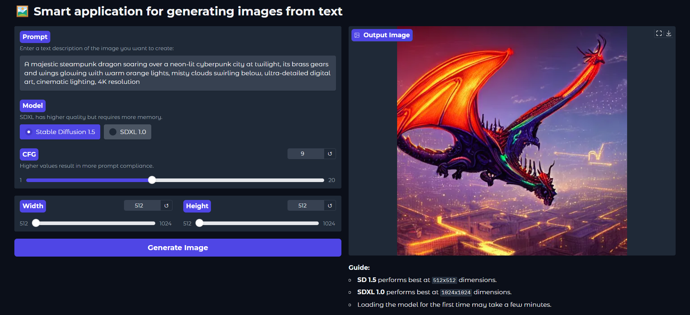
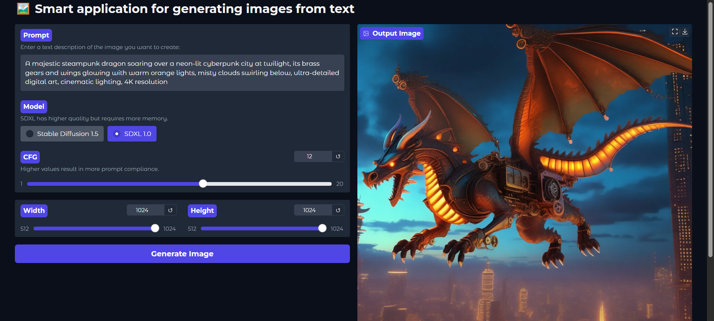

# 🚀 Smart-Text-to-Image-Generator



Smart-Text-to-Image-Generator is a user-friendly web application for generating high-quality images from text prompts using the latest Stable Diffusion models.  
Built with **Gradio** and **Diffusers**, it features smart model caching and runs on GPU for maximum performance!

## ✨ Features

- **Multiple Models**: Choose between SDXL 1.0 and Stable Diffusion 1.5
- **Model Caching**: Optimized memory management for quick switching
- **Fully Interactive**: Change prompt, CFG, size and model on the fly
- **Modern UI**: Beautiful Gradio interface, ready for sharing
- **Device-Aware**: Automatically detects and uses your GPU

## 🔥 Quick Start

1. **Clone the repo**
    ```bash
    git clone https://github.com/your-username/Smart-Text-to-Image-Generator.git
    cd Smart-Text-to-Image-Generator
    ```

2. **Install dependencies**
    ```bash
    pip install -r requirements.txt
    ```

3. **Run the app**
    ```bash
    python app.py
    ```

4. Open the Gradio link in your browser and start generating images!


## 🎬 Demo Video

[▶️ Click here to watch the demo (MP4, 1.7MB)](assets/test_video.mp4)

## 📸 Screenshots
> 

## ⚙️ Usage Guide

- **SD 1.5** works best at `512x512`.
- **SDXL 1.0** works best at `1024x1024` (and needs more VRAM).
- First load may take 1–2 minutes (models are ~2–5GB).

## 🛠️ Customization

- You can add more HuggingFace models to `MODEL_IDS` in `app.py`.
- For advanced settings, edit the `generate_image` function as needed.

## 🤝 Contributing

Feel free to open issues or submit pull requests.  
Star the repo if you like it!

---

Made with ❤️ by [Mohammad Khodadad](https://github.com/mohammadkhodadadzd)
